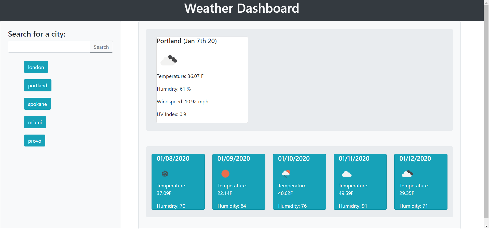

# Project Title
​ weather dashboard
## Overview
​
The purpose of this application is to ...
​ the point of this program is to give you a website that you can look up any city of the world and it will give you a current weather
card and also a five day forecast under the current weather. when you look up a city there will be buttons that are created under
the search bar that will give you your search histroy that you can click on and it will automatically search that city. 
### Gallery
​
Home:

​
### Problem
​
Currently ...
​ currently there are no issue with it, i did try to create a button that would clear your search history buttons. 
### Solution
​
My solution will ...
​ I have no solution currently, I tried clearing the div and clearing the local storage but when I searched something else the 
buttons that I just cleared came back again. 
## Tech and Features Used
​
* Bootstrap
* CSS
* HTML
* Javascript
* Jquery
* Open Weather API
​
## How to use
​
when the page first loads up you will be given a search bar in the top left corner that you can look up any city in the world. 
when you look up the city it will give the current weather and a five day in the future forecast. when you look a city up
there is a button under that search bar with the name of the city you just looked up. 
​
## Technical Overview
​
1. when the page loads up there is a search bar that will ask for the city you want to look up. 
2. when you press the search button is sends an ajax call to the weather api with the search term you just gave it. 
3. when you look something up there is also dynamically created buttons with the name of the city you looked up. 
4. when you press those buttons it makes the same ajax call that dynamically creates the cards like in the search ajax calls. 
5. the search history is sent to the local storage which makes the buttons stay even when you reload the page. 
